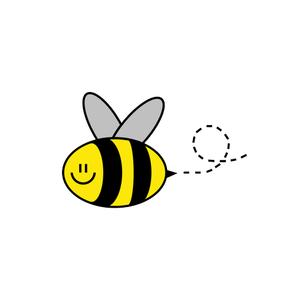

<h2>Hi everyone</h2>

Ale, ou mais conhecida como alessandrizes, é desenvolvedora frontend e engenheira da computação. Super apaixonada por doces, pela queen Bey e pela cultura asiática.

<h4>Caso queira acompanhar mais conteúdos:</h4> 

  
  
  
  
  

